# InclusiveAID – Visão Geral do Projeto

> Use cada seção como um *slide* individual. Adicione, remova ou reordene conforme a sua apresentação.

---

## 1. Problema & Motivação

- +1 bilhão de pessoas no mundo possui algum tipo de deficiência (OMS).
- Sites e assistentes virtuais raramente oferecem **acessibilidade by-default**.
- Criação de um **assistente web inclusivo**, adaptável a múltiplas necessidades, com stack moderna.

---

## 2. Objetivos do InclusiveAID

1. Oferecer interface **modular** capaz de ativar/desativar recursos de acessibilidade.
2. Persistir configurações **localmente** (`localStorage`) e **na nuvem** (Back4App – Parse).
3. Adotar boas práticas **WCAG 2.1**, código limpo e performance.

---

## 3. Arquitetura de Pastas

```mermaid
flowchart TD
  A["app/"] -->|UI & Rotas| B["onboarding/"]
  A --> C["navegador/"]
  A --> D["components/"]
  A --> E["context/"]
  A --> F["lib/"]
  G["docs/"] --> H["Você"]
```



---

## 4. Fluxo de Dados (Alto Nível)


---

## 5. Onboarding (3 Etapas)

1. **Boas-vindas** – mensagem TTS inicial.
2. **Necessidades** – seleção de deficiências com feedback sonoro.
3. **Recursos** – toggles de alto contraste, narração, libras…

```tsx
// AcessibilidadePage (trecho)
function toggleRecurso(idx: number) {
  setRecursos(prev => {
    const updated = prev.map((v,i)=> i===idx ? !v : v);
    setFeature(recursosList[idx], updated[idx]);
    if (features['Ativar narração']) {
      speak(`${recursosList[idx]} ${updated[idx] ? 'ativado' : 'desativado'}`);
    }
    return updated;
  });
}
```

---

## 6. AccessibilityContext (Core)

```tsx
// Estados globais
const [needs, setNeedsState] = useState<string[]>([]);
const [features, setFeatures] = useState<Record<string, boolean>>({ 'Ativar narração': true });

// 1) Persistência local
useEffect(() => {
  localStorage.setItem('inclusive_aid_accessibility', JSON.stringify({ needs, features }));
}, [needs, features]);

// 2) Sync remoto (debounce + offline-safe)
useEffect(() => {
  if (typeof window === 'undefined') return;
  const ctrl = new AbortController();
  const t = setTimeout(async () => {
    if (!navigator.onLine) return console.warn('offline, adiando sync');
    const id = localStorage.getItem('inclusive_aid_profile_id');
    const endpoint = id ? `/api/profiles/${id}` : '/api/profiles';
    const method: 'PUT' | 'POST' = id ? 'PUT' : 'POST';
    const res = await fetch(endpoint, { method, signal: ctrl.signal, headers: { 'Content-Type': 'application/json' }, body: JSON.stringify({ needs, features }) });
    if (res.status === 404) {
      localStorage.removeItem('inclusive_aid_profile_id'); // recria no próximo loop
    } else if (res.ok && !id) {
      const { id: newId } = await res.json();
      localStorage.setItem('inclusive_aid_profile_id', newId);
    }
  }, 500); // debounce 500 ms
  return () => { ctrl.abort(); clearTimeout(t); };
}, [needs, features]);
```

---

## 7. TTS + Legenda Automática

```tsx
export function speak(text: string) {
  const synth = window.speechSynthesis;
  const utter = new SpeechSynthesisUtterance(text);
  utter.lang = 'pt-BR';
  synth.cancel();
  synth.speak(utter);
  window.dispatchEvent(new CustomEvent('inclusiveaid_caption', { detail: text }));
}
```

```tsx
// CaptionOverlay
const { features } = useAccessibility();
if (!features['Ativar Legenda']) return null;
return <div className={styles.overlay}>{text}</div>;
```

---

## 8. Integração Back4App (Parse)

```ts
// lib/parseServer.ts
import Parse from 'parse/node';

export function getParse() {
  const { PARSE_APP_ID, PARSE_JS_KEY, PARSE_MASTER_KEY, PARSE_SERVER_URL } = process.env;
  if (!Parse.applicationId) {
    if (PARSE_MASTER_KEY) {
      Parse.initialize(PARSE_APP_ID!, PARSE_JS_KEY!, PARSE_MASTER_KEY);
    } else {
      Parse.initialize(PARSE_APP_ID!, PARSE_JS_KEY!);
    }
    Parse.serverURL = PARSE_SERVER_URL!;
  }
  return Parse;
}
```

```ts
// api/profiles/route.ts (trecho)
const Parse = getParse();
const query = new Parse.Query('AccessibilityProfile');
// Só usa master key se ela existir
const results = await query.find((Parse as any).masterKey ? { useMasterKey: true } : undefined);
```

---

## 9. Deploy & Variáveis de Ambiente

| Chave              | Exemplo                                |
|--------------------|----------------------------------------|
| PARSE_APP_ID       | abCDeFGhijKLMNOprstUVwxyz123456        |
| PARSE_JS_KEY       | zyxwvUTSRqpoNMLkjihgfedcba654321       |
| PARSE_MASTER_KEY   | 0123456789abcdef0123456789abcdef       |
| PARSE_SERVER_URL   | https://parseapi.back4app.com/         |

*`PARSE_MASTER_KEY` é opcional*: se omitido, o backend opera somente com permissões da **JS Key**. Caso exista, as rotas internas utilizam `useMasterKey` automaticamente para criar/atualizar perfis.

CI/CD: Vercel → adiciona as três variáveis no painel **Project Settings > Environment**.

---

## 10. Próximos Passos & Roadmap

- Autenticação Parse `_User` para perfis multi-dispositivo.
- **i18n** completo (pt-BR, en-US, es-ES) usando `next-intl`.
- Testes automatizados (Jest, RTL, axe-core).
- Integração com **dispositivos Braille** via WebUSB.

---

## 11. Contato

**InclusiveAID** · MIT License · github.com/seu-user/inclusive-aid-front

> Obrigado! Perguntas? 😄 